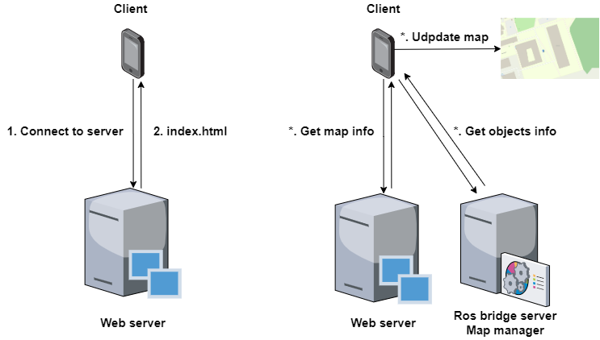
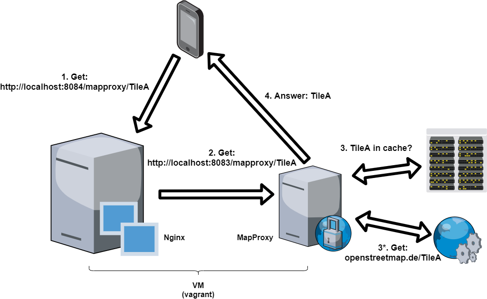
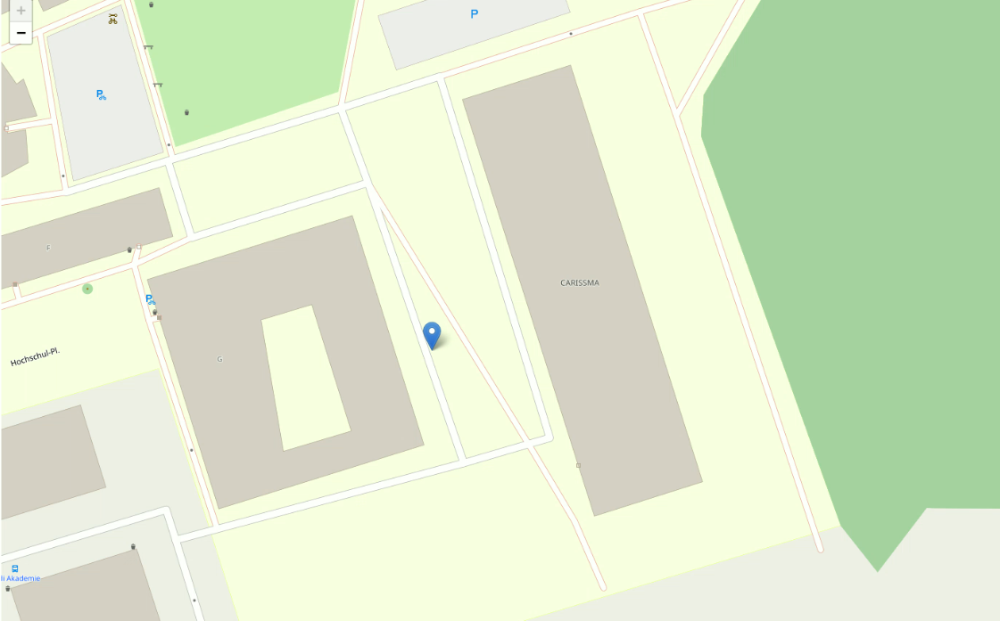

# V2X Visualization Framework -V2 (VVF)

## All you need is VVF

VVF-v2 provides a visualisation tool for CAM, CPM, and DENM
All the packages relavant to Testfield and Car2x Car are consolidated in a single workspace.

VVF is composed of 8 different packages:
* A NGinx server for the welcome and map webpage
* A Mapproxy proxy to cache the tiles
* A RosBridge server to send the objects (from CAM, CPM, DENM) directly from a ROS topic.  

VVF provides a visualisation tool for CAM, CPM, and DENM (still ongoing). 
It relies on Mapproxy, OSM, and Leaflet to visualise objects on the map. The advantage of VVF is that from the moment the server has cached the map tiles, no internet connection is required anymore.
Any device that has a web browser (Firefox, Brave, and Chrome tested) can visualise the results when connected to the appropriate network.

Major part the tiles proxy realization has been done thanks to [mapproxy osm cache sample](https://github.com/communaute-cimi/mapproxy-osm-cache-sample).  
This work is part of the Cooperatively Interacting Automobiles [CoInCar](https://www.coincar.de/#/) project.

## Description
VVF is composed of 3 main different modules:
* A NGinx server for the welcome and map webpage
* A Mapproxy proxy to cache the tiles
* A RosBridge server to send the objects (from CAM, CPM, DENM) directly from a ROS topic.  

The Nginx and Mapproxy modules are created automatically in a small Ubuntu Virtual Machine using Vagrant and Ansible.  

The relation between the different modules is shown here 

### The web server
The web server provides the visualisation tool to any connected device. It is composed of a Nginx server (default
configuration on port 8084) as well as a Mapproxy proxy (port 8083). It relies on openstreemap (configurable)
 and [Leaflet](https://leafletjs.com/) for the visualisation.  
   
There are two kinds of request performed to the server, the ones for downloading the map tiles and the ones to get the web 
pages. The ones for the tiles are managed by the proxy and the interaction is explained by the image below.     
The proxy is used for two purposes: fastened requests for tiles and allow the framework to operate offline (if the necessary tiles are cached).
By default, the proxy never removes the tiles downloaded.  
  
To avoid to mess up current system, both server and proxy can be easily installed in a VM thanks to Vagrant and Ansible.  
To start and setup them, you need an internet connection and perform "vagrant up" in the git repository. It should
take around 5 to 10 min to complete. If successfully done, you should now see a map [here](http://localhost:8084).

#### Requirements for the Web server

* Virtualbox (or other virtualisation product supported by Ansible)
* Vagrant
* Ansible
* Internet connection

#### Installation
Execute "Vagrant up" in the root of this git repository. 

### V2X communications
This framework relies on the [ros_etsi_its_msgs](https://github.com/CoFra-CaLa/ros_etsi_its_msgs) package.  
V2X communications are implemented thanks to the ROS integration of [Vanetza](https://github.com/riebl/vanetza).
This ROS implementation is currently not available, if you want more information, please contact us.
It can currently generate CAM, CPM, and DENM using Cohda and Autotalks boxes.

### Visualisation
The visualisation framework is a web page accessible from any devices that can connect to the web server. The web page 
should show a map similar to this one.   
Cursors can be added to the map thanks to the so-called map-providers.
A map-manager node is responsible to collect information from the map-providers and provide them to the clients of the server.

### Requirements for the Visualisation 
There are some requirements before compiling the project:  
1. [ROS](https://www.ros.org/) (tested on melodic and noetic)  
2. [Rosbridge](http://wiki.ros.org/rosbridge_suite)
3. [ros_etsi_its_msgs](https://github.com/CoFra-CaLa/ros_etsi_its_msgs)

# Credits
This work is part of the CoFra-CaLa organization within CARISSMA & THI in Ingolstadt.
Main contributors are Quentin Delooz, Marc Armansin, and Christina Obermeier

# List of improvements/bugs to do
- [ ] Find a good name :)
- [ ] improve website - add CSS to popup
- [ ] Possibility to print only a selection of the markers (e.g. only show CAMs)
- [ ] New markers for objects
- [ ] Security/load assessment
- [ ] heading - orientation to improve
- [ ] Localisation Kalman filter
- [ ] Center on one marker
- [ ] Clean up all includes - msgs - dependencies
- [ ] Use different markers for different sources
- [ ] Map provider to be more flexible for compilation and run (avoid to recompile)
- [ ] HMI information -> put on the side of the map
- [ ] Add repetition possibility
- [ ] Integrate to ThingsBoard

